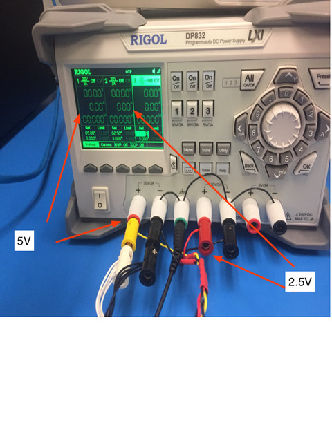
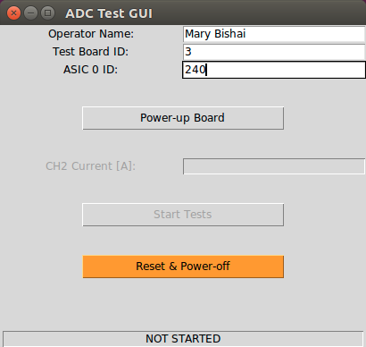
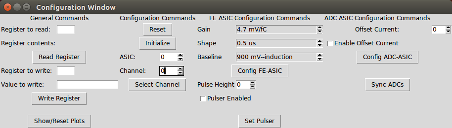
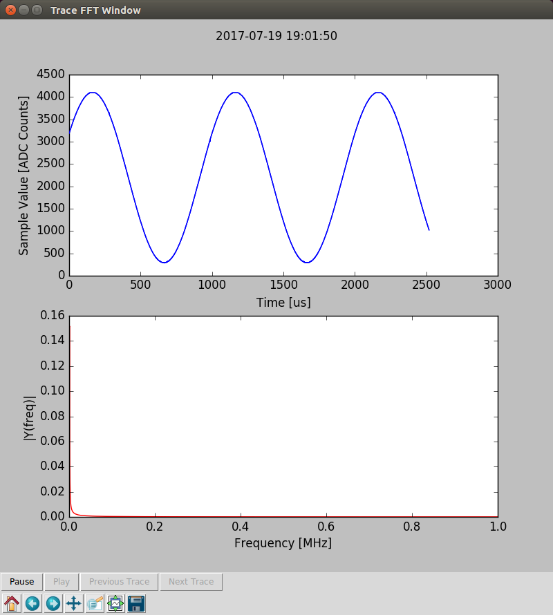
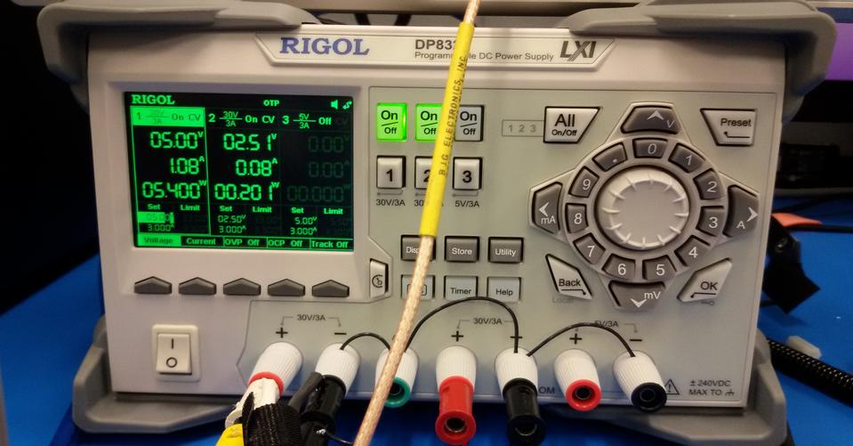

ADC ASIC Test-stand Cold Test Shifter Instructions
==================================================

1) Chip/testboard preparation instructions:
   ----------------------------------------
  * Always use latex gloves when handling the boards/chips (unless you are allergic) 
  * Check the board status on the whiteboard. If a testboard has failed more than once,
    move it to the cleaning and recovery area and select a different board.
  * Make sure the chip to be tested hasnt failed previously. Check
    the Google docs. Any chip that failed (didnt complete tests) should be moved
    to the bad ADC holder.
  * CHECK THE MEZANNINE BOARD IS SCREWED IN TIGHTLY
  * Insert NEW chip into the clamshell. Use magnifying glass to verify proper alignment of pins.
  * Start a new basket label with board and chip number.
  * Close clamshell and cable the board if it is not cabled up:

  

2) Basket and board assembly instructions
   ---------------------------------------

  * Make sure dewar is covered and moisture is wiped off the lip

  * Connect DRY basket above covered dewar

  * Place board in the basket.

  * Connect cables to DAQ computer making sure cables are dressed properly and there is enough slack:
  
     - Ethernet cable is connected to back of DAQ computer to slot labeled DAQ
     - USB cable from blaster is connected to one of the two USB connectors in the front of the computer
     - Lemo is connected to the channel labeled "Output" on the RIGOL function generator
     - Red and Black test board power cable goes to CH2 of the power supply (2.5V)
     - Yellow and black and White and Black power cables for the FPGA mezannine go to CH1 of the power supply (5V)

   

3) Start up a fresh FE ADC Tests GUI - BUT DO NOT RUN YET
   ------------------------------------------------------
   * Click on the FE ADC Tests icon on the desktop
   * Fill in your name, test board id and ASIC id

    

4) Initialize the ADC and sync with the FPGA mezannine:
   ----------------------------------------------------

   * Run the setup script by typing
   
      femb_adc_setup_board
 

   You will see

   FEMB_CONFIG--> Config ADC ASIC SPI  
   FEMB_CONFIG--> Program ADC ASIC SPI  
   FEMB_CONFIG--> Check ADC ASIC SPI  
   FEMB_CONFIG--> ADC ASIC SPI is OK  
   FEMB_CONFIG--> Reset FEMB is DONE  
   FEMB_CONFIG--> Start sync ADC  
   FEMB_CONFIG--> Test ADC 0  
   Starting testUnsync adc:  0  
   FEMB_CONFIG--> ADC not synced, try to fix  
   try shift: 0 phase: 0 testingUnsync  

   ...  

   FEMB_CONFIG--> ADC synchronized  
   FEMB_CONFIG--> Latch latency 0x00000006 0x00000000 Phase: 0xfffc0000  
   FEMB_CONFIG--> End sync ADC  
   Successfully setup board.  
   
 
   * If the sync fails or if a chip doesnt sync immediately:
       - Turn the power off
       - Try reseating the chip in the socket.
         CHECK THE MEZANNINE BOARD IS TIGHTLY SCREWED IN
       - Power cycle and rerun the script.
       - If this doesnt work after several attempts, try putting in a new chip and then a new board.

   * Switch the power off and repeat this step. Make sure chip synchs immediately after cycling power twice and
     rerunning the initialization and sync script.

5) Start monitoring the chip output
   ---------------------------------

   * Open the monitoring GUI by typing

     femb_gui

   

   

   * Adjust the waveform generator to generate a sine wave:

     - On the RIGOL wave function generator click on the burst button once to take local control

     - Make sure SINE, CH1 and OUTPUT1 are all clicked on.

     - Adjust Sine wave parameters till you see the waveform output from the chip clearly. Recommended settings
     are 1 kHz, 1.3V high level, 100mV low level

     [insert instructions for the Keysight generator here]

    * Check the output of the different channels. Continuously monitor output while dunking. 

6) Dunking instructions:
   ---------------------
   Leave chip ON and and reading out and now start lowering it into the dewar slowly, watch the waveform on the GUI and
   make sure it is stable or reverts to stability after each step lowering it into the dewar. Also use the "Synch ADC
   button on the GUI to resynch after each insertion step.

     * Lower the basket until the LN just touches the bottom of the basket. Leave it there until boiling subsides
     * Lower the basket until LN is just above the white chip power connector, check current draw and leave for 20 seconds
     * Lower until LN is just below the clamshell, leave for 20 seconds
     * Lower in 3/4" increments (use meter stick) waiting for 20 seconds or until waveform on GUI stabilizes whichever is longer
     * Once LN completely covers clamshell, secure the basket rope.

     * if you lose the readback from the chip while immersing in the cold:
         - Close the waveform GUI  and try step 5) and 6) and see if it recovers. 
         - Make sure waveform generator is correctly configured. 
       	 - Check the current draw to make sure a cable hasnt failed.

7) Run the FE ADC Tests
    --------------------

   * If all goes well and chip is fully immersed and reading out correctly, stop the femb_gui and make
    sure it exits and releases control of the FEMB.

   * Start running the FE ADC Test GUI you opened in step 4:
      - Click on power up board.
      - After board power up and initialization enter the ASIC current draw (CH2 on power supply). Current draw
        is typically 0.09 +/- 0.02 A
      - Click on Start tests.

     

   * Remember to record the run number, board number and chip number in the CE Teststands LogBook on Google docs.
     There is a bookmark to the logbook on the Firefox web browser
   
   * If the run completes successfully, mark a Y in the appropriate column on Google docs.
     If run fails, note the failure error in the Google doc LogBook and make sure to indicate
     on the white board that the testboard failed in the cold. Test boards that fail more
     than once should be returned to Guang/Feng/Shanshan for cleaning.

8) After cold ADC test completes (or fails):
   ----------------------------------------
    * Pull the basket out of the LN quickly
    * Cover with plastic bag while still hanging and use clothes pegs to close the bag
    * Wait for 10 minutes till cables warm up. Use timer to time yourself.
    * Dress the cables and tie them off with the velcro.
    * Tag basket, remove it from the pulley and put it under the table.
      REMEMBER TO INDICATE TEST STATUS ON THE TAG!
    * Leave covered basket under the table to dry further for another 10 minutes (use timer)
    * If the test failed to complete, put a mark against the board number on the whiteboard in the
      column corresponding to the board.
    * If the test completed successfully remove any marks in the board column on the whiteboard  

9) Drying instructions:
    -------------------- 
      * Wait 10 minutes for the board in the bag to reach room temperature. 
      * Remove board and uncable. 
      * Remove chip from clamshell and put it in the appropriate box:  good if a test completed bad if it didnt
      * Put wet board in the drying box with the blow dryer set to 120F. Put the cold ends of the cables in drying box
      * If the board failed twice in a row (see whiteboard) - put it in the bad board cardboard box.