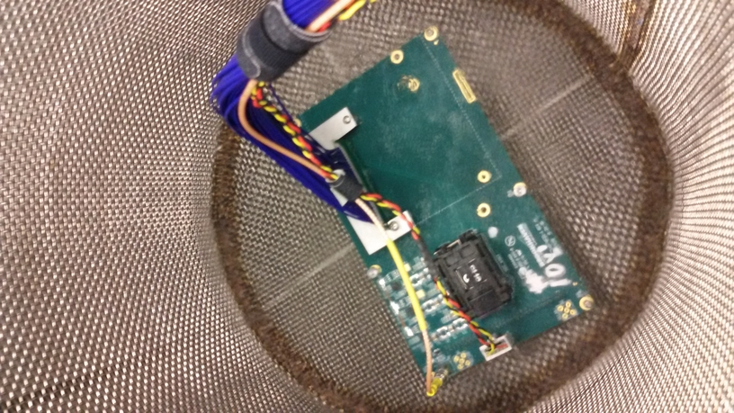

ADC ASIC Test-stand Cold Test Shifter Instructions
==================================================

# 1) Chip/testboard preparation instructions :
  

 * Always use latex gloves when handling the boards/chips (unless you are allergic) 
 * Check the board status on the whiteboard. If a testboard has failed more than once,
    move it to the cleaning and recovery area and select a different board.
 * Pick a chip from the box titled "Test Me" or "Retest" (shift leader will tell you which). Check
    the Google docs. Any chip from "Retest) that failed earlier should not be tested with the same board.
 * Insert NEW chip into the clamshell. Use magnifying glass to verify proper alignment of pins. The large dot on the chip should line up with the top right corner of the clamshell.
 * Start a new basket label with board and chip number.
 * Close clamshell and cable the board if it is not cabled up:

## a) Vertical insertion cabling:

Check the mezannine board is screwed in tightly to the testboard

 
  
## b) Horizontal insertion cabling

Horizontal and vertical cabling are the same with the addition of a long blue cable between the mezannine 
board and the test board:

 

# 2) Basket and board assembly instructions 
 
 * Make sure dewar is covered and moisture is wiped off the lip
 * Connect DRY basket above covered dewar

## a) Vertical insertion:

 * Place board in the basket as shown.

 

 * Connect cables to DAQ computer making sure cables are dressed properly and there is enough slack:
  
     - Ethernet cable is connected to back of DAQ computer to slot labeled DAQ
     - USB cable from blaster is connected to one of the two USB connectors in the front of the computer
     - Lemo is connected to the channel labeled "Output" on the RIGOL function generator
     - White and black mezannine board power cables go to CH1 of the power supply (5V)
     - Red and Black test board power cables go to CH2 of the power supply (2.5V)
     - Yellow (and black) test board power cables go to CH3 of the power supply (5V)

   

## b) Horizontal Insertion

 * Place cabled board in the basket such that it lies at the bottom of the basket as
   flat as possible. Use velcro to tie off the big blue cable to the basket handle such
   that the test board is stable horizontally at the bottom of the basket. 
 * Check connections at DAQ computer, power supply and function generator as described above. 

# 3) Check ADC functionality and stability in the warm:

   * With the board in the basket but before you start inserting in the cold, run a series of stability tests.
   
   * Start a new terminal and run the setup script by typing
   
      femb_adc_setup_board_cold
 

   You will see

   FEMB_CONFIG--> Config ADC ASIC SPI  
   FEMB_CONFIG--> Program ADC ASIC SPI  
   FEMB_CONFIG--> Check ADC ASIC SPI  
   FEMB_CONFIG--> ADC ASIC SPI is OK  
   FEMB_CONFIG--> Reset FEMB is DONE  
   FEMB_CONFIG--> Start sync ADC  
   FEMB_CONFIG--> Test ADC 0  
   Starting testUnsync adc:  0  
   FEMB_CONFIG--> ADC not synced, try to fix  
   try shift: 0 phase: 0 testingUnsync  

   ...  

   FEMB_CONFIG--> ADC synchronized  
   FEMB_CONFIG--> Latch latency 0x00000006 0x00000000 Phase: 0xfffc0000  
   FEMB_CONFIG--> End sync ADC  
   Successfully setup board.  
   
 
   * If the sync fails or if a chip doesnt sync immediately:
       - Turn the power off using the following command

        femb_power_supply --turnOff
	
       - Try reseating the chip in the socket.
         CHECK THE MEZANNINE BOARD IS TIGHTLY SCREWED IN
       - Rerun the script:

         femb_adc_setup_board_cold
       
       - If this doesnt work after several attempts, try putting in a new chip and then a new board.
       	 REMEMBER TO TURN POWER OFF!

   * Switch the power off and repeat this step: 

      femb_power_supply --turnOff

      femb_adc_setup_board_cold   

     Make sure chip synchs immediately after cycling power twice and
     rerunning the initialization and sync script.
  
   * Check Altera USB blaster is working. A blue LED light should be on and you need to power on the testboard:

     femb_power_supply --turnOn (if power is off)

     femb_firmware_check_progammer

# 4) Start monitoring the chip output

   * Click on the ADC Cold Test Gui icon on the desktop. Put in your name and test board id and ASIC id:

   
  
   * Click "Re-Power-up & Setup Board". The board will resynch one more time and a GUI
     window showing the read back from 16 chips using an input sine wave will be shown:

   

   * To adjust the waveform generator to generate a sine wave:

     - On the RIGOL wave function generator click on the burst button once to take local control

     - Make sure SINE, CH1 and OUTPUT1 are all clicked on.

     - Adjust Sine wave parameters till you see the waveform output from the chip clearly. Recommended settings
     are 1 kHz, 1.3V high level, 100mV low level

     [insert instructions for the Keysight generator here]

    * Check the output of the different channels. Continuously monitor output while dunking. 

# 5) Dunking instructions

## a) Vertical Insertion:

  Leave chip ON and and reading out and now start lowering it into the
  dewar slowly, watch the waveform on the 16 channel GUI and make
  sure it is stable or reverts to stability after each step lowering
  it into the dewar. Tapping the chip and/or socket lightly may be
  necessary to restore stability. Please ask the shift leader to do
  this.

  * Lower the basket until the LN just touches the bottom of the basket. Leave it there until boiling subsides
  * Lower the basket until the LN is just below the white bottom connector on the socket board.
  * Lower the basket until LN is just above the white chip power connector, check current draw and leave for 20 seconds. Current draw on CH2 (2.5V) of the power supply should be 0.09 +/- 0.02 A     
  * Lower until LN is just below the clamshell, leave for 20 seconds
  * Lower in 3/4" increments (use meter stick) waiting for 20 seconds or until waveform on GUI stabilizes whichever is longer
  * Once LN completely covers clamshell, secure the basket rope.

  * if the readback from the chip starts going bad while immersing in the cold:
  - Fully insert the chip
  - Check the current draw to make sure a cable hasnt failed.
  - Lightly tap on the chip using the plastic stick - protect your hands from the cold!
  - Close the waveform GUI  and click on "Re-setup Board" and see if it recovers.

## b) Horizontal Insertion

  * Lower the basket until the LN just touches the bottom of the basket. Leave it there until boiling subsides
  * Lower the basket further until LN is just below the test board and wait until boiling subsides (at least 30 seconds).
  * Lower to the bottom of the clam shell and wait 30 seconds. Watch the 16 channel GUI to make sure chip readout is stable.
  * Lower until chip and clam shell are fully submerged. If readout becomes unstable or synch is lost, tap the chip gently (ask shift leader)

 

# 6) Run the FE ADC Tests

  * If the chip is fully submerged the readout is stable on all 16 channels. Click on "Collect David Adams Data" 

  * After the "David Adams" data is collected a plot of the 16 channels with triangular ramp data is displayed. 
     If DA data looks okay (no ratty or missing plots ) mark a Y in the appropriate column on Google docs.
     There is a bookmark to the logbook on the Firefox web browser: 

   * After DA data is done, click on "Start Tests". 
   
   * After tests are complete, indicate "Tests Complete" on the Google docs LogBook and note which checks failed.

   

   * If the tests fail, note the failure error in the Google doc LogBook and make sure to indicate
     on the white board that the testboard failed in the cold. Test boards that fail more
     than once should be returned to shift leader and put out of circulation for the day.

# 7) After cold ADC test completes (or fails):

 * Pull the basket out of the LN quickly
 * Cover with plastic bag while still hanging and use clothes pegs to close the bag:

 

 * Tag basket, REMEMBER TO INDICATE TEST STATUS ON THE TAG (Failed, DA complete, All tests complete)
 * If the test failed to complete, put a mark against the board number on the whiteboard in the column corresponding to the board.
 * If the test completed successfully remove any marks in the board column on the whiteboard  

## a) Vertical Insertion

 * Wait for 5 minutes till cables warm up. Use timer to time yourself.
 * Uncable and dress the cables and tie them off with velcro.
 * Remove basket from the pulley and put it under the table. REMEMBER TO PUT THE TAG ON.
 * Leave covered basket under the table to dry further for another 10 minutes (use timer)

## b) Horizontal insertion

 * Leave basket hanging
 * Wait 10 minutes for board and cables to warm up. Use timer.
 * Remove plastic bag and then the board from the basket
 
# 9) Drying instructions

## a) Vertical Insertion

 * MAKE SURE POWER IS OFF.
 * Wait 10 minutes for the board in the bag to reach room temperature. DO NOT LEAVE THE TEST BOARD FOR 
   MORE THAN 15 MINUTES IN THE BAGGED BASKET. 
 * Remove board and uncable.
 * Remove chip from clamshell and put it in the appropriate box:  "Done Testing" if a test completed, "Retest" if it didnt and "Bad" if the chip is physically damaged or has failed tests twice on different boards.
 * Use compressed air to blow the moisture off the socket board front AND back.       
 * Put wet board in the drying oven with the thermostat set no higher than 120F. Put the cables in as well. Let the board dry in the oven for 15 minutes.

 * If the board failed twice in a row (see whiteboard) - put a label on it as "bad" and remove it from circulation.

## b) Horizontal Insertion:

 * Wait 10 minutes for the board in the bag to reach room temperature. DO NOT LEAVE THE TEST BOARD FOR 
   MORE THAN 15 MINUTES IN THE BAGGED BASKET. 
 * If board failed, shift leader will uncable and replace board.
 * If board is operational do not uncable. Leave basket hanging and pull
   board out of the basket.
 * Use compressed air gun to remove all moisture from board with chip still in clam shell.
 * Remove chip from clamshell and put it in the appropriate box:  "Done Testing" if a test completed, "Retest" if it didnt and "Bad" if the chip is physically damaged or has failed tests twice on different boards.
 * Use compressed air to dry out the open clamshell. Make sure to blow around the big connector to the
   mezannine board as well.
 * Use hot air gun at 120F to complete drying the board.
 * Make sure to also use compressed air and blue wipes to dry the basket as well.

# 10) How to recover from common failure modes

* Errors with FEMB_UDP failure to read register: usually means that the ethernet connection between
 the FPGA mezannine and the DAQ is lost. To recover:

  - Make sure power is on (use femb_power_supply --turnOn)
  - Try to reseat the ethernet cable at both the mezannine and DAQ ends
  - Run the following command twice:
        sudo restart-network
  - Check you can read back from the femb:

   femb_read_reg 5

   you should get back 0x0000000

* JTAG errors: the FPGA USB firmware programmer sometimes fails if it gets too cold. You will get an indiction
       of an error on the bottom of the ADC Test GUI. Scroll up in the terminal and for "Error while programming firmware"
       You can check if the programmer is working using the commands in Step 3. To recover:

       - Reseat the USB connection on the DAQ end or plug into another USB port
       - Reseat the firmware programmer (little black box) on the mezannine end. Remember to protect
	 your hands if it is cold.
       - If all else fails and the end of the firmware programmer attached to the mezannine board is not too
	    cold, replace with a different blaster.

* SPI readback errors: This error means that the software is unable to verify the chip is properly initialized
       by reading back the values from a register. This is the most common reason for chip failure in the cold and is
       mostly due to socket problems not the chip. You can try gently tapping on the chip and clicking on "Re-setup Board",
       but it is difficult to recover from. Move on to the next chip and leave this chip to be retested another time
       with another socket board.

