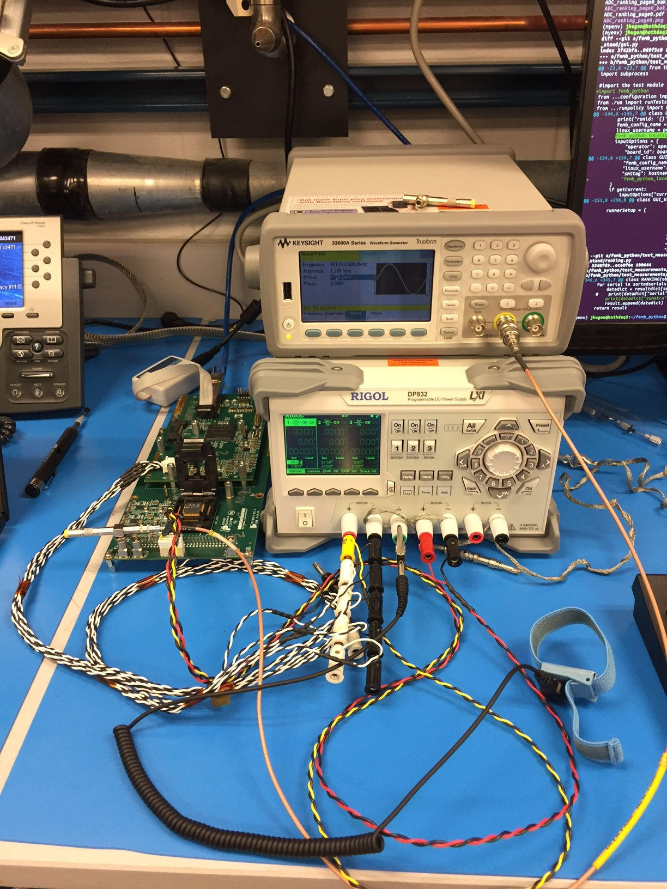
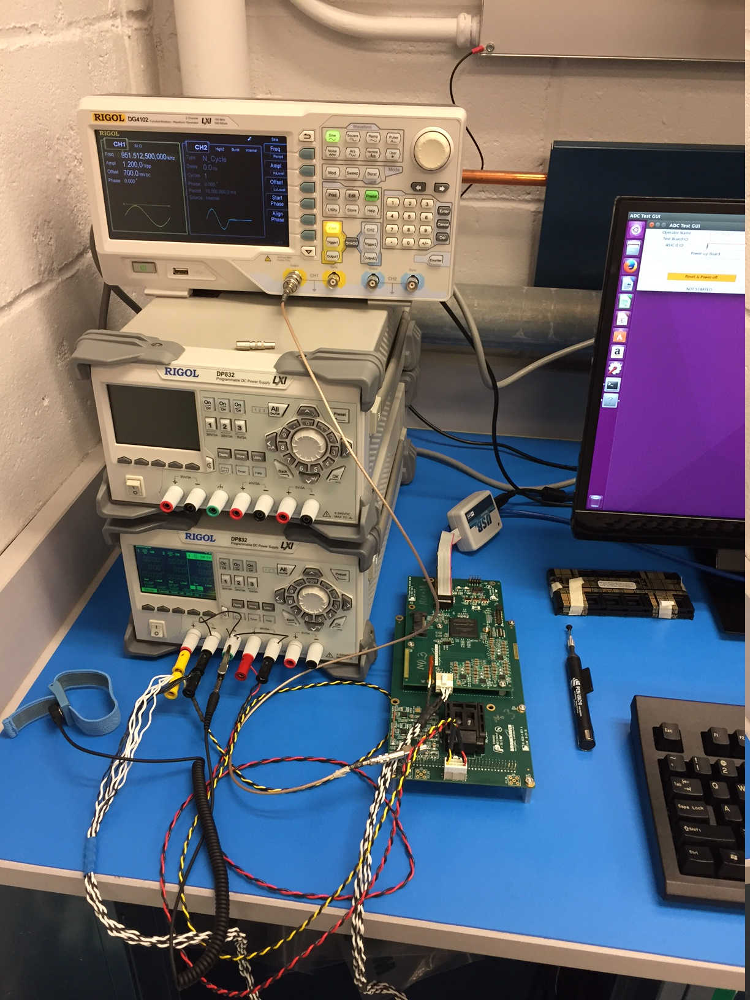
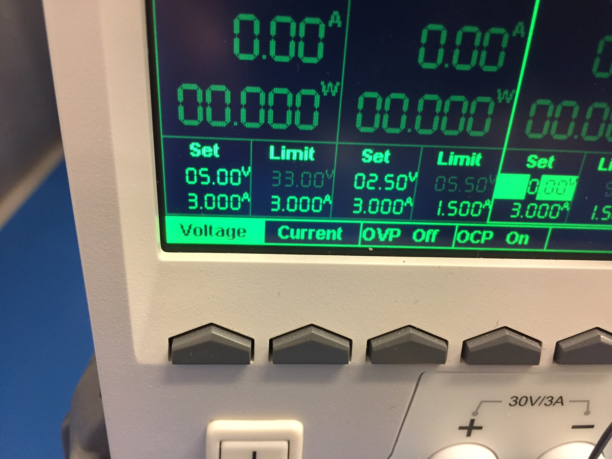

ADC Test-stand Expert Documentation
===================================

ADC Test Problems
-----------------

If you ever have a crash or error in the test GUI, make sure to just try
running the test another time or two before contacting an (more) expert or
performing the following steps.

**Try this for most issues**, especially when you have communications problems
with the board or other devices:

1. Make sure the USB-blaster, power supply, and signal generator are all 
   connected to the PC with USB cables.
2. Try power cycling the power supply and signal generator and when that is 
   complete, shut down the PC and turn it on again (don't just restart).

If that doesn't fix it, you could try further diagnostics on the USB interfaces:

1. Run the `lsusb` command. Make sure a device matches the brand name of each
   of the USB devices. This is Rigol, Agilent for the Keysight signal generator,
   or Altera for the USB-blaster firmware programmer. If all 3 devices aren't 
   visible, then try restarting the devices and make sure they are hooked up 
   via USB.
2. For the power supply and signal generator, make sure that `ls -l /dev/usbtmc*`
   lists /dev/usbtmc0 and /dev/usbtmc1, both with the group usbdaq. If they
   are not listed, then you have the same problem as in 1. If the group is not
   usbdaq, contact Brett for help.
3. For the USB-Blaster, run the command `femb_firmware_check_programmer`. This 
   command should print something like:

   ```
    1) USB-BlasterII [3-2]
      028130DD   EP4CGX50
   ```

   If not, then you are having trouble talking to the USB-Blaster. You can try 
   killing the jtagd process by running `killall jtagd`, then see if 
   `femb_firmware_check_programmer` works. If not, try restarting the PC.
4. Try programming the 2 MHz firmware with `femb_firmware_program` and the 1 MHz 
   with `femb_firmware_program -1`. If that works then firmware programming should 
   work in the GUI. If not, maybe the error messages can help you debug the problem
   (or send them to an expert).

Test Board Physical Setup
-------------------------

The setup for hothdaq3 looks like this:



The setup for hothdaq4 looks like this:



Channel 1 of the signal generator should be hooked into the LEMO T-connector
and then hooked into the bottom-left most input on the ADC board. If R31 is
present, there is no need for a 50 Ohm terminator, otherwise, plug it into the
other side of the T-connector.

The white/black set of power supply wires should hook into the FPGA mezzanine,
while the yellow/black red/black wires should hook into the ADC board. The
red/black pair of wires should be hooked up to power-supply channel 2. All
other pairs to channel 1.

The Power supply voltages and currents are shown here:



Channel 1 should be set to 5 V and 3 A, with a limit at 3 A. Channel 2 should
be set to 2.5 V and 3 A with a current limit at 1.5 A.

The USB-blaster should be hooked up to the "P8" header, which is in between the
FPGA and Ethernet connector. The cable should go out over the Ethernet cable.

On a new ADC board, make sure there is a dot on the socket on the corner
nearest the LEMO inputs for the shifter to use.

Make sure the USB-blaster, power supply, and signal generator are all connected
to the PC with USB cables.

Summary of Many Runs
--------------------

The "ana" user on the hothdaqs copies all of the summary json files to
hothstor2, where "ana" runs scripts that make summary plots. These are
displayed on a webserver for you to view.

From the hothdaqs or inside the BNL network, you should be able to access it by
pointing your browser to http://hothstor2.phy.bnl.gov/~ana/

From outside the firewall, you need to tunnel into hothstor2 with a command
like `ssh -L 8080:localhost:80 hothstor2` then you can point your browser to
http://localhost:8080/~ana/ to access the page.

Summaries are run at 02:22 every day for the previous day's data, and 03:33 on
Mondays for the previous week's data. On Fridays at 03:33 the previous Friday
throuth Thursday's data is summarized for the shift meeting. The Monday and
Friday run also run so_far that summarizes all data taken so far.

One can also download the data in `hothstor2:~ana/adc_summary_json/` and make
summaries using the `femb_adc_ranking` command. The command line help, `-h`,
shows how to limit the time range.

