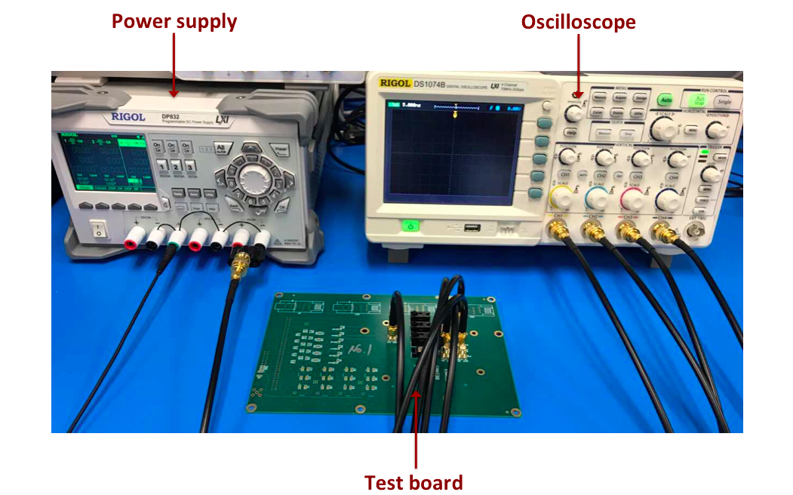
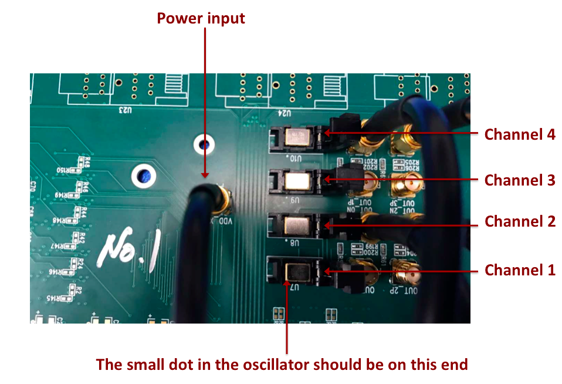

Oscillator Testing Instructions
==============================

Introduction
-------------------------
100 MHz oscillators go through 3 thermal cycle. In each thermal cycle, room temperature oscillators are submerged in LN2 and are powered cycled 50 time. In each cycle, the measured frequency is extracted and saved. At the end of the the power cycles, summary of the results is printed out.

Setup
-------------------------
Below is the picture of the oscillator testing setup. Channel 3 of the DC power supply (RIGOL TECHNOLOGIES, DP832) provides 3.3 V to the test board. The output from the test board are connected to the 4 channels of the digital oscilloscope (Rigol Technologies, DS1074B). 


Below is the picture of the close-up of the test board. Oscilloscope channel corresponding to each socket is also shown. Please note that the small dot in the oscillator should be towards the mentioned end.


Testing procedure
-------------------------
Code is set up by doing:
```
export FEMB_CONFIG="osc"
```
Then the test is run by typing:
```
femb_osctest
```
Basically, the test boils down to the tester typing y/n to the command line prompts, like the one below:
```
Finished thermal cycle 1!
Are the oscillators removed from LN2?
(y/n): y


Starting thermal cycle 2!
Are the oscillators cold and ready for testing?
(y/n):
```

The prompts will guide the shifter through all three thermal cycles and prints out the summary of results in the end, like the one below:
```
*********************************************************************************
Summary of results:
*********************************************************************************
                             Cycle 1             Cycle 2             Cycle 3
	Channel 1             Passed              Passed              Passed
	Channel 2             Passed              Passed              Passed
	Channel 3             Passed              Passed              Passed
	Channel 4             Passed              Passed              Passed
*********************************************************************************
```					      
To dry the board, set the heat gun at 120 F and move it around the board until everything on outside looks completely dry. Then open the socket lid, take out the oscillator and dry some more. One thing to be careful is to put the oscillator back to the same socket as before; so placing the oscillators in a paper with marks like 1, 2, 3, 4 to identify the corresponding oscillator is useful.


